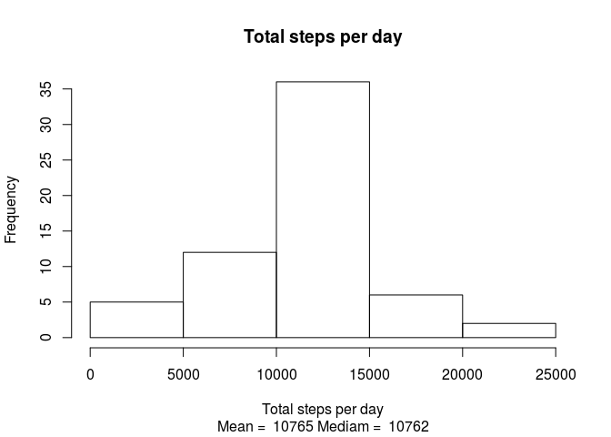

# Reproducible Research: Peer Assessment 1

##Introduction
The data is the number of steps an anonymous voluntier walked. The data is recorded in five minutes intervals from 01-10-2012 until 30-11-2012. We load the data from a zip file and answer some questions about it.

## Loading and preprocessing the data
The data is saved in a zip file. I assumed that the zip file is already in the working directory. Unzip the file if not already and read it.

```r
#check if the zip file is already unzipped nad unzip it.
if (!file.exists("activity.csv")){
        unzip("activity.zip")
}
#read the data
activity <- read.csv("activity.csv", colClasses = c("integer", "character", "integer"))
```
To prepare the data, two columns are added. One to show which day of the week each date is and another for wheter a day in a weekday or weekend.

```r
#convert the date column to date class.
activity$date <- as.Date(activity$date, "%Y-%m-%d")
library(data.table)
#convert to data table for simplicity and speed
activity <- data.table(activity)
#add the weekdays and weekday or weekend column
activity[,weekday := weekdays(activity$date)]
wDays <- c("Montag", "Dienstag", "Mittwoch", "Donnerstag","Freitag")
activity[,wDay := factor(activity$weekday %in% wDays,
                         levels = c(TRUE, FALSE), labels = c("weekday", "weekend"))]
```

## What is mean total number of steps taken per day?
In most of days the subject walked 10 to 15 thousands of steps per day. The subject does not seem to be so sporty as the freqency of total steps goes realy down after 15000 steps. The mean and median are written under the plot.

```r
require(dplyr)
#summary the data to compute the total steps per day
b <- activity %>% group_by(date) %>% summarise(stepDay = sum(steps, na.rm = T))
#plot the histogram
hist(b$stepDay, main ="", xlab = "")
title(main = "Total steps per day", sub = paste("Mean = ",                                                                       as.character(floor(mean(b$stepDay))),
                                              "Mediam = ",
                                              as.character(median(b$stepDay))),
                                              xlab = "Total steps per day")
```


## What is the average daily activity pattern?
We would like to see how is the activity of the subject during an typical day. We averaged the number of steps on each five-minute interval in the whole study period.

The subject is clearly more active around 800's interval (probably midday). The maximum average number of steps has happend in the 835'th interval


```r
#summary the data to compute the average of steps based on each interval.
b <- activity %>% group_by(interval) %>% summarise(meanstepsinterval =mean(steps, na.rm =T))
plot(b$interval, b$meanstepsinterval, type = "l" , 
     main = "Average of steps in each interval in all days",
     xlab = "Interval", ylab = "Number of steps")
```


```r
#The interval wiht the maximun averge steps
b$interval[b$meanstepsinterval == max(b$meanstepsinterval)]
```

```
## [1] 835
```


## Imputing missing values
There are total of 2304 intervals with missing number of steps value. I filled it with the average of the same interval in the whole period.

```r
#Total number of missing values
sum(is.na(activity$steps))
```

```
## [1] 2304
```

Filling the no values and reploting the histogram, it can be seen that the frequency of average of less than 5000 steps a day is fewer which seems resonable as filling NA's raise the averge. But apart that the overal pattern is similar.


```r
#Fill the null values by average steps in the same interval in all days
activityfull <- fillNA(activity)
```
Below is the histogram with filled no values. I ommited the code from the output as it is exatly the same as the previous histogram.



## Are there differences in activity patterns between weekdays and weekends?
The aim is to compare activity in week days and weekends. So two time series plots with intervals vs average of steps in each interval is plotted. 

One can see that the subject starts walking and ends activity considerably later  in weekends. Also activity in weekends has less versatility.


```r
b <- activityfull %>% group_by(interval, wDay) %>% 
        summarise(meansteps = mean(steps, na.rm = T))
qplot(interval, meansteps, data = b, facets = wDay~., geom = "line",
      main = "Average steps on each interval",
      ylab = "Number of steps")
```


##Question
Why 2355 intervals? There are just 288 five-minute in 24 hours.
